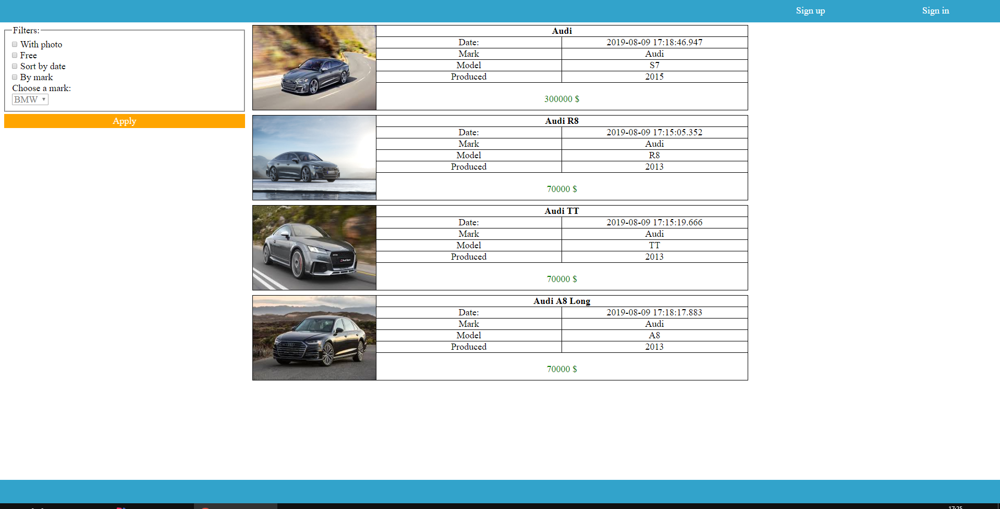
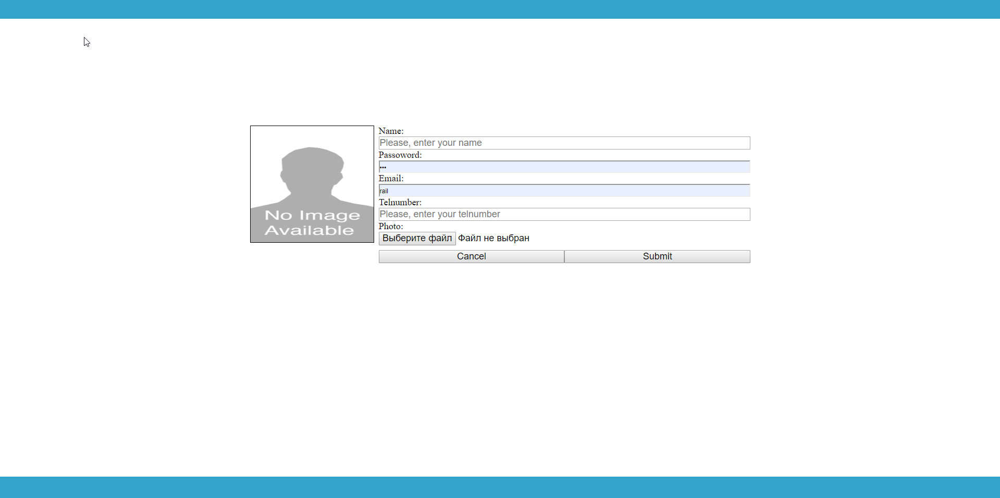
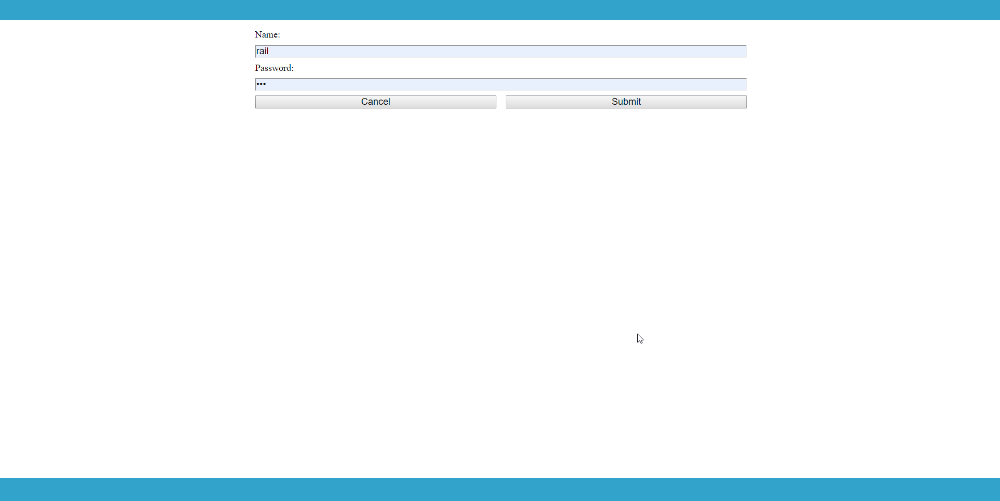
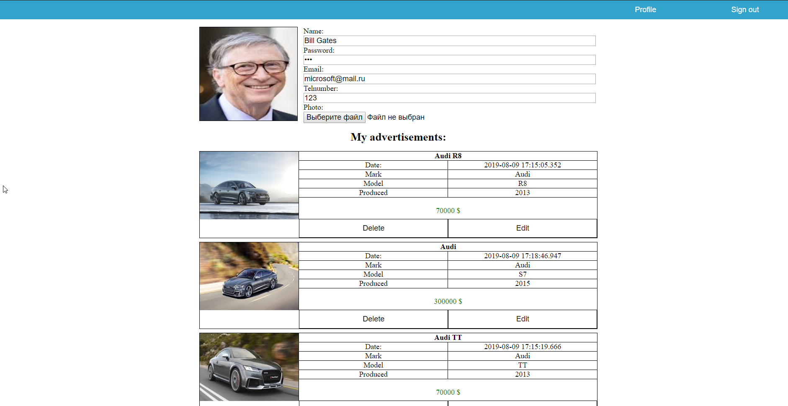
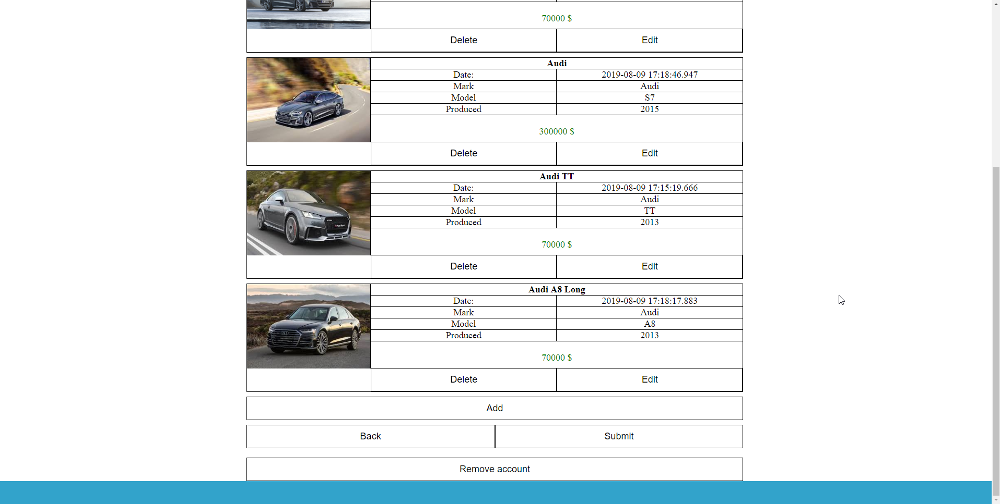

# ToDo List

### Description

This project represents simple online auto marketplace.

### Functionality

- CRUD operation for users
- CRUD operation for advertisements
- Filtering advertisements
- Authorization/Authentication

### Used technologies

- Frontend Technologies
  - HTML5/CSS3
  - Javascript/JQuery/Ajax
- Backend Technologies
  - Java EE (Servlets, JSP, Filters)
  - Hibernate
  - PostgreSQL
### Images

Main page

Signup page

Signin page

Profile pages

