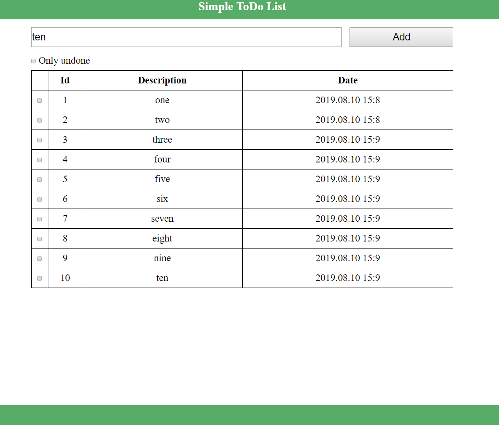

# ToDo List

### Description

This project represents basic todo list application

### Functionality

- Creating simple tasks
- Done/Undone tasks
- Hiding done tasks
- Storing/Loading tasks in/from DB

### Used technologies

- Frontend Technologies
  - HTML5/CSS3/Bootstrap
  - Javascript/JQuery/Ajax
- Backend Technologies
  - Java EE (Servlets, JSP)
  - Hibernate
  - PostgreSQL
### Images

